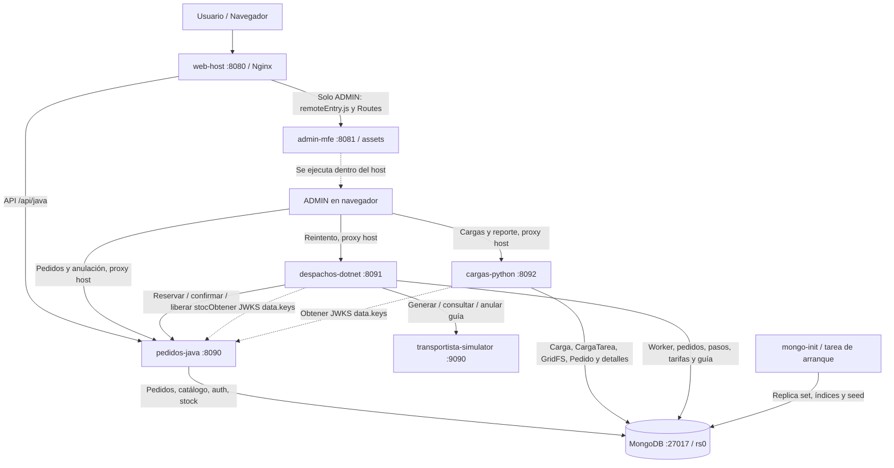
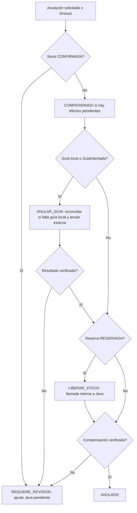
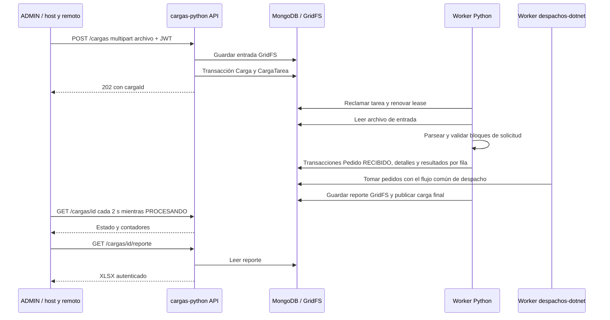

# Flujo de servicios

Diagrama derivado de [docker-compose.yml](../../docker-compose.yml), [proxy del host](../../frontend/web-host/nginx.conf) y los adaptadores/coordinadores del código. Los puertos son los publicados al equipo anfitrión. El remoto es código que corre en el navegador; su contenedor entrega los assets, no ejecuta peticiones de negocio en el servidor.

Las flechas de ADMIN hacia APIs representan HTTP desde el navegador a los prefijos del Nginx del host. No hay llamadas directas ADMIN → transportista. Python no llama POST /pedidos de Java para importar: crea pedidos compatibles en Mongo; Java solo participa como proveedor JWKS para su autenticación. El simulador no persiste en Mongo.

## 1. Pedido normal y reserva

```mermaid
sequenceDiagram
    participant B as Navegador / host
    participant J as pedidos-java
    participant M as MongoDB
    participant D as Worker despachos-dotnet
    participant T as Transportista
    B->>J: POST /pedidos (JWT, solicitudId, almacén, líneas)
    J->>M: Transacción Pedido RECIBIDO y PedidoDetalle
    J-->>B: 202 nuevo / 200 repetido / 409 conflicto
    D->>M: Adquirir Worker y tomar pedido con lease
    D->>J: POST /internal/pedidos/id/stock/reservar
    J->>M: Transacción de todas las líneas y EstadoReserva
    J-->>D: RESERVADA o error de stock
    D->>M: Leer ZonaTramo y guardar envío/total
    D->>T: GET /guias?pedidoId=id
    alt Guía ausente (404)
        D->>M: Persistir GuiaIntentada antes del efecto
        D->>T: POST /guias + Idempotency-Key estable
        T-->>D: Guía o respuesta perdida
        opt Resultado incierto
            D->>T: GET /guias?pedidoId=id para reconciliar
            T-->>D: Guía existente o ausencia verificable
        end
    else Guía existente
        T-->>D: Guía para reutilizar
    end
    D->>M: Guardar guía local y pasos
    D->>J: POST /internal/pedidos/id/stock/confirmar
    J->>M: ReservaStock -= cantidad y CONFIRMADA, transacción
    J-->>D: Estado de reserva confirmado
    D->>M: Cierre condicional DESPACHADO sin anulación pendiente
    B->>J: GET /pedidos/id
    J-->>B: Estado, importes, guía y pasos
```

La reserva exige `CantidadStock >= cantidad` y mueve disponible a reservado. Confirmar reduce reservado sin volver a descontar disponible. El cálculo del envío lo realiza .NET con tarifas Mongo, no el transportista. El diagrama muestra el camino exitoso; si no hay stock, la transacción revierte todas las líneas y el coordinador puede terminar ANULADO sin generar guía.

## 2. Compensación

Java registra la solicitud de anulación; .NET ejecuta los pasos. Se anula la guía antes de liberar stock. Un pedido ya DESPACHADO rechaza la solicitud con 409; repetirla sobre ANULADO es idempotente. La carrera posterior a CONFIRMADA no se presenta como compensación completada. Evidencias: [E2E 09](../../tests/evidencias/e2e09-anulacion-durante-proceso.json) y [10](../../tests/evidencias/e2e10-anulacion-estados-finales.json).

## 3. Recuperación de Worker

1. `Worker` mantiene una corrida abierta, propietario, versión y heartbeat. El proceso vivo renueva su lease; sin renovación, vence.
2. Otro ciclo de adquisición reclama condicionalmente esa misma corrida, incrementando `LeaseVersion` e `Intentos`. Las escrituras verifican el lease y actualizan `Secuencia` transaccionalmente.
3. Se busca un pedido incompleto EN_PROCESO/COMPENSANDO ligado a la corrida; se incrementa `IntentoProceso`. Los estados terminales no se reabren.
4. El coordinador consulta reserva, importes y guía persistidos. Reconciliar el transportista resuelve el caso de guía creada con respuesta perdida; no reinicia ciegamente todos los efectos.
5. Tras resolver el pedido interrumpido, cierra la corrida recuperada. Errores agotados o inconsistencias pueden llevar a REQUIERE_REVISION.

Evidencias: [E2E 11](../../tests/evidencias/e2e11-tarea-repetida.json), [12](../../tests/evidencias/e2e12-reinicio-despachos.json) y [13](../../tests/evidencias/e2e13-caida-mongodb.json). El proxy de `tests/integration` empleado para retener la respuesta en escenarios de caída es una herramienta de prueba, no un servicio permanente del Compose base.

## 4. Carga masiva

El procesamiento de carga y el despacho pueden solaparse: PROCESADA significa importación finalizada, no todos los pedidos despachados. El reporte informa filas ACEPTADA/RECHAZADA/DUPLICADA. No hay transacción que abarque el archivo GridFS y todos los pedidos de la carga; la atomicidad funcional de importación es por bloque. Evidencias: [E2E 15](../../tests/evidencias/e2e15-carga-masiva-500.json) y [16](../../tests/evidencias/e2e16-carga-masiva-trafico.json), con la salvedad de trazabilidad de repeticiones indicada en [LEEME](../../LEEME.md).

## Fuentes de implementación

- [Java: repositorio transaccional](../../services/pedidos-java/src/main/java/pe/reto/pedidos/adapter/out/mongo/MongoRepositorio.java).
- [.NET: coordinador](../../services/despachos-dotnet/src/Despachos.Application/Coordinador.cs), [clientes HTTP](../../services/despachos-dotnet/src/Despachos.Infrastructure/Http/Clientes.cs), [worker](../../services/despachos-dotnet/src/Despachos.Api/Workers/DespachoWorker.cs).
- [Python: worker](../../services/cargas-python/app/application/worker.py) y [persistencia](../../services/cargas-python/app/infrastructure/mongo.py).
